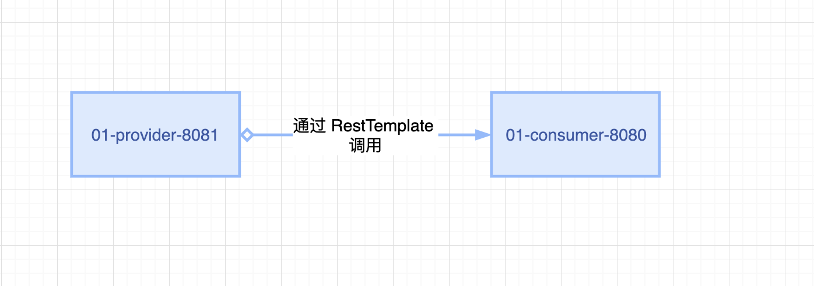
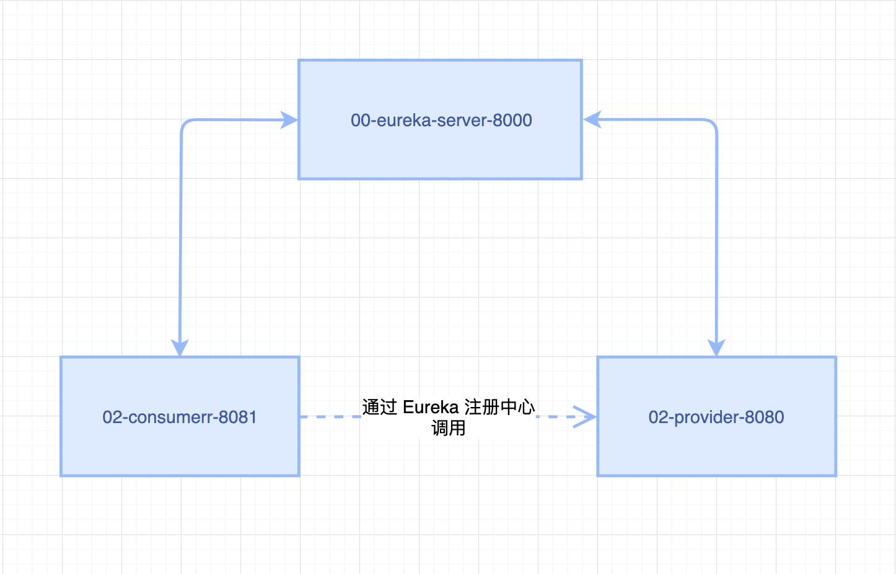
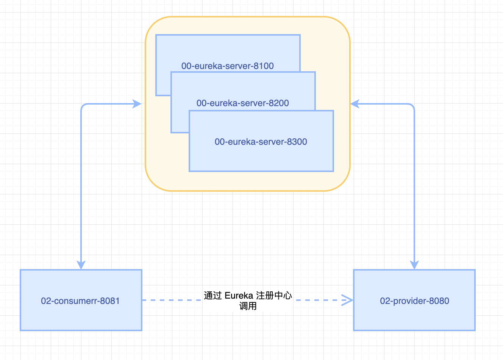

# spring-cloud-learn-showcase

### 1、使用 RestTemplate 实现消费者对提供者的调用。
消费者通过直连调用提供者，必须要在消费者服务中指明提供者的服务URL，形成了强耦合。

### 2、添加 Eureka 注册中心，通过 Eureka 实现消费者对提供者的调用。

服务消费者和提供者启动后，将服务注册到 Eureka 中，消费者通过在 Eureka 中查询服务来调用提供者。

#### 2-1 单机 Eureka

#### 2-2 集群 Eureka

### 3、

### 4、
