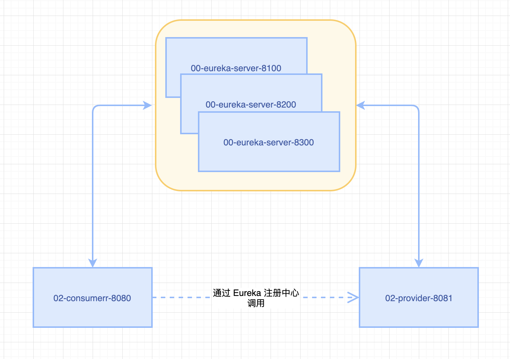
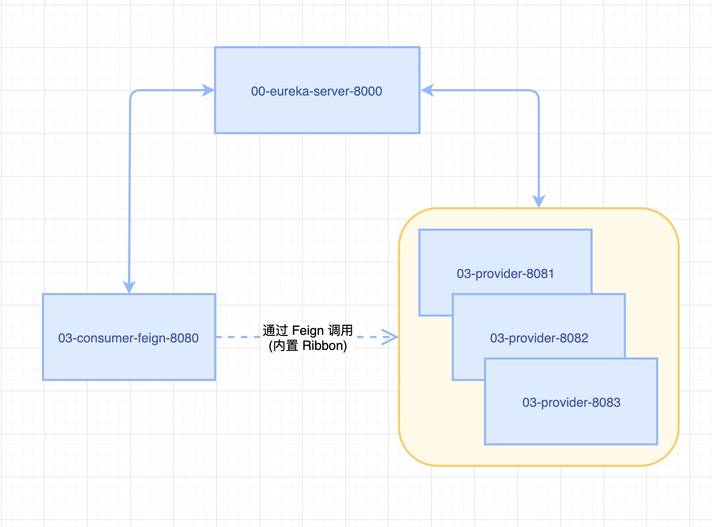
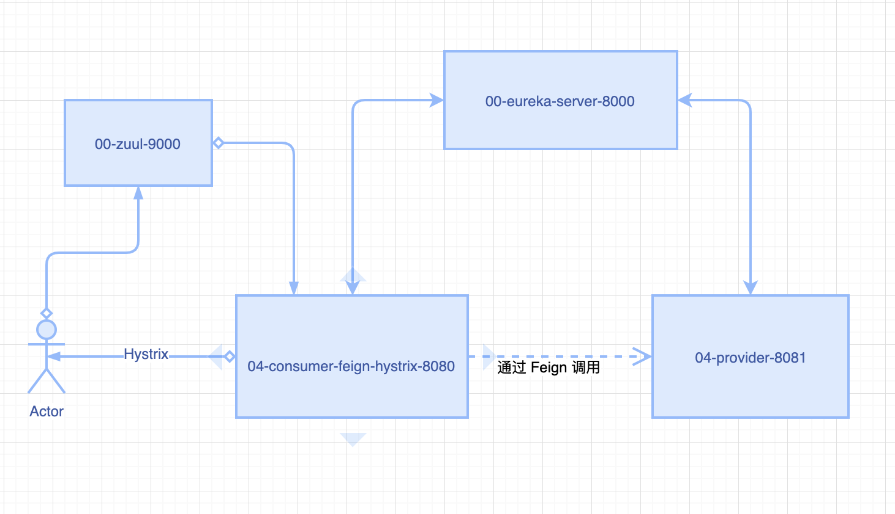
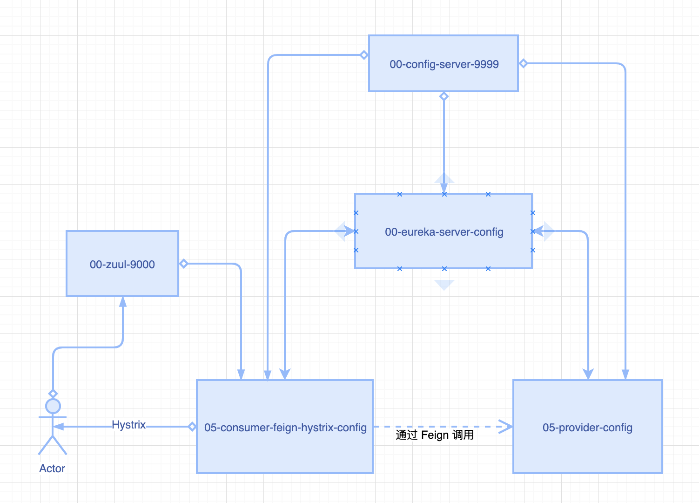

# spring-cloud-learn-showcase

* Eureka
* Feign 、Ribbon
* Hystrix
* Zuul
* Spring Cloud Config

### 1、使用 RestTemplate 实现消费者对提供者的调用。
消费者通过直连调用提供者，必须要在消费者服务中指明提供者的服务URL，形成了强耦合。


### 2、添加 Eureka 注册中心，通过 Eureka 实现消费者对提供者的调用。
服务消费者和提供者启动后，将服务注册到 Eureka 中，消费者通过在 Eureka 中查询服务来调用提供者。

#### 单机 Eureka


#### 集群 Eureka


### 3、使用 Feign 实现实现消费者对提供者的调用(Eureka 注册中心)

#### 单一提供者


#### 集群提供者


### 4、在服务消费者端添加 Hystrix 服务容错处理


### 5、添加 Zuul 网关
添加了 Zuul 网关后，消费者接口 (http://localhost:8080/consumer/depart/list)
可使用url (http://zuulgateway.com:9000/04-consumer-feign-hystrix-8080/consumer/depart/list) 进行访问。



### 6、使用 Spring Cloud Config 统一管理配置



### Hosts 文件
```
127.0.0.1 	eureka8100.com
127.0.0.1 	eureka8200.com
127.0.0.1 	eureka8300.com
127.0.0.1	eureka8001.com
127.0.0.1	eureka8002.com
127.0.0.1	zuulgateway.com
127.0.0.1 	configserver.com
```

